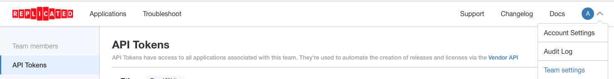

KOTS Applications
==================

Manifests of multiple applications, showcasing how easy it is for various applications to get up and running with KOTS. 

# Installing KOTS Applications to Existing Kubernetes Clusters 

1. Identify the application slug based on the root directory of the application (e.g., for /nginx-ingress/, `APP_SLUG=nginx-ingress`)
2. Ensure that you have KOTS installed (e.g., `curl https://kots.io/install | bash`)
3. Execute `kots install` for the name of the application directory (e.g., `kubectl kots install nginx-ingress`)

# Installing KOTS Applications to Machines without Kubernetes (Embedded cluster installs)

1. Identify the application slug based on the root directory of the application (e.g., /nginx-ingress/, `APP_SLUG=nginx-ingress`)
2. Use `curl` to perform a `kURL Install` using the name of the application directory (e.g., `curl -sSL https://kurl.sh/$APP_SLUG | sudo bash`)

# List of Applications:  

* nginx-ingress : Ingress setup to a running instance of NGINX
* mongodb-mtools : Example mongoDB application running custom support analyzers using mtools

# CONTRIBUTING (Developer Setup)

1. Create a fork of this repository. 
2. On your Vendor account (create one, if needed), create an API token from the [Teams and Tokens](https://vendor.replicated.com/team/tokens) page: 
</img>

3. Ensure the token has "Write" access or you'll be unable create new releases. 
4. Configure the `REPLICATED_API_TOKEN` github secret in your forked repository (see [configuring secrets](https://help.github.com/en/github/automating-your-workflow-with-github-actions/virtual-environments-for-github-actions#creating-and-using-secrets-encrypted-variables) for more details. 
5. Set the `REPLICATED_API_TOKEN` in your local environment (e.g., `export REPLICATED_API_TOKEN=...`)
6. Go to the directory of the desired application (e.g., `nginx-ingress`) and ensure this is working by running `make list-releases`)
7. To iterate on your application, simply push changes to the `app-slug/manifests` directory. This will initiate a github action to make a new release. The branch name will correspond to the application channel (e.g., `stable`, `unstable` )

## Creating a new kotsapp

1. Create a new directory matching the name of the kotsapp (e.g., /reporoot/newkotsapp)
2. Create a manifests folder within the directory with initial content. 
3. Create a workflow matching the name of the kotsapp, ensure it triggers on the appropriate path (e.g., 'newkotsapp/**')
4. Create a license for all channels in the root of the application directory (License.yaml, License-Unstable.yaml, License-Beta.yaml). 

## Tools reference

- [replicated vendor cli](https://github.com/replicatedhq/replicated)

## License

MIT
