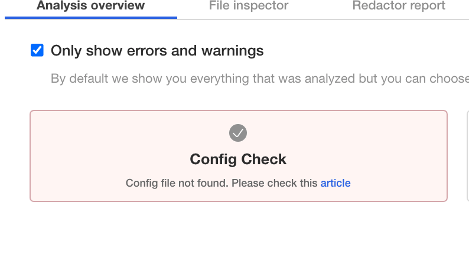

<h1> Solution for Replicated Quest for the Ring </h1>

If you have landed here, you probably are have run into this issue:

<p align="center"></img></p>

This error is caused when the app does not find a specific file with the proper permissions on startup. The application is looking for a file called `config.txt` located in `/etc/ring-game/` which is a [hostPath](https://kubernetes.io/docs/concepts/storage/volumes/#hostpath) Volume attached to the Pod. The file must have `400` permissions.

To solve the issue, create the file and assign `400` permissions.

<details>
  <summary>Open for a hint on how to create the file and assign permissions</summary>

To create the file with the proper permissions run the following command on the terminal:

```shell
$ sudo touch /etc/ring-game/config.txt
$ sudo chmod 400 /etc/ring-game/config.txt
```

</details>

The Pod may need to be restarted, in that case, get the list of pods and delete the offending pod. Its ```Deployment``` should schedule a new one right away.

<details>
  <summary>Open for a hint on how to find the offending pod and delete it</summary>

To get the list of pods, run the following command:

```shell
$ kubectl get pods
```

You should see an output similar to this:

```shell

NAME                                  READY   STATUS                  RESTARTS   AGE
file-check-pod-76c6bc76d-7xk2d        1/1     Running                 0          9m57s
kotsadm-7d68c66d9-wbx5t               1/1     Running                 0          87m
kotsadm-postgres-0                    1/1     Running                 0          87m
kubecon-game-77b49b445-mwfvn          0/1     Init:CrashLoopBackOff   6          9m57s
kurl-proxy-kotsadm-75cf6dcf54-m74vm   1/1     Running                 0          87m


```

The offending pod is the one in the `Init:CrashLoopBackOff` STATUS. To delete the pod, run the following command:

```shell

$ kubectl delete pod kubecon-game-77b49b445-mwfvn

```

Once the new pod is up and running, go back to the Admin Console to click on the "Complete the Quest!" button.