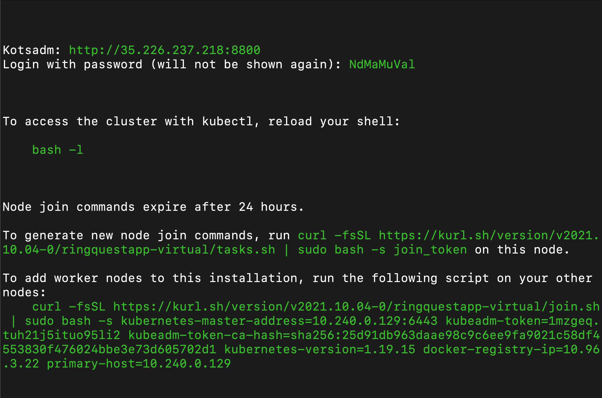
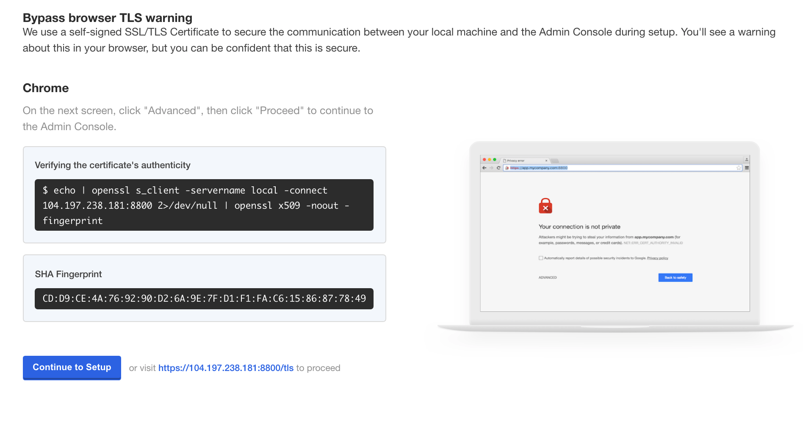
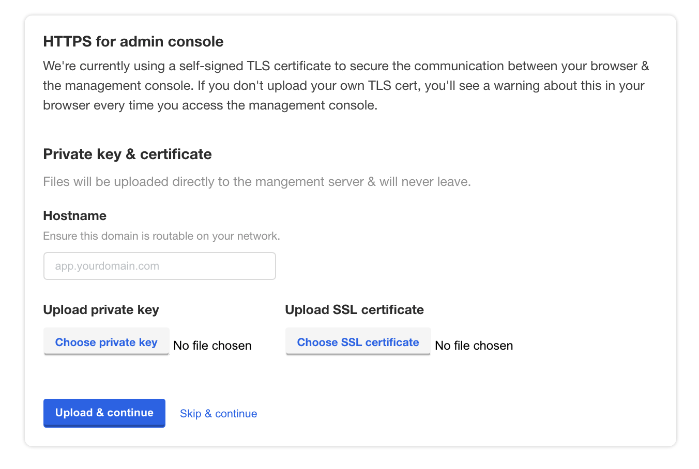
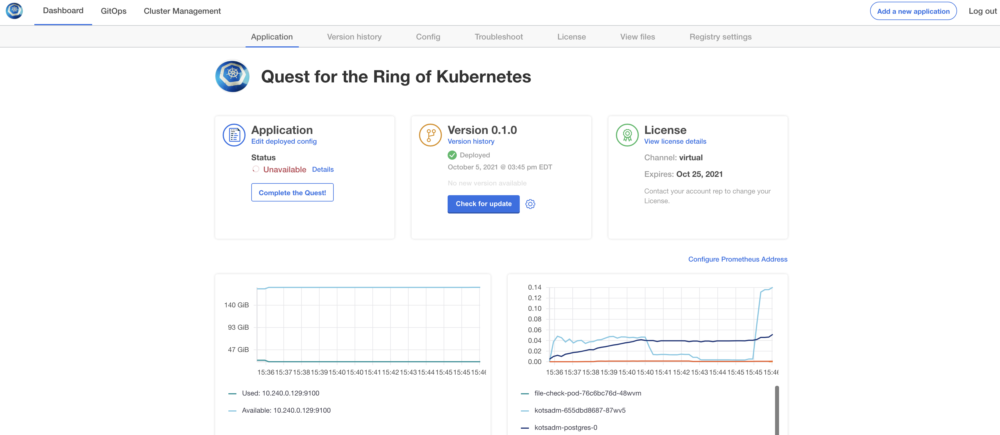

<h1>Kubecon 2021 Quest for the Ring Game</h1>

Thank you for participating in the Quest for the Ring Game with Replicated!

Please read through the entire instructions before you get started and let us know if you have any questions.

**Overview**

In this Quest, you will be tasked with getting a Kubernetes Application up and running on a Linux Host. Succeed and there will be treasures beyond your wildest dreams! Well.. actually we have Kubernetes rings and some Replicated swag.

You will be armed with Replicated open source tooling to help you on your quest.

**Connect to VM**

An Ubuntu machine has been provisioned for you and this is where our adventure begins.

If you do not have the IP address of your VM, please let us know. This should have been given to you in an email prior to this session.

To connect to the VM, we will `ssh` into it. For example, you may run something like:

```shell
$ ssh kots@{IP_Address}
```

**Start Installation**

Once you have logged in to the remote host, paste the following install command

```shell
 $ curl -sSL https://k8s.kurl.sh/ringquestapp-virtual | sudo bash
```

This will download and install kubernetes on the Linux host. For the installation of the cluster, we are leveraging [KURL](https://kurl.sh) which is a Replicated Open Source project. This project allows you define Kubernetes Add-ons, including the version and some configurations. One of the Add-ons that will be deployed is [KOTS](https://kots.io), which is another Replicated Open Source project. This project helps people manage the deployment and maintenance of Kubernetes Applications.

**Deploy the Application**

Once the installation is complete, you should see output similar to the screenshot below. Scroll up if needed, to find the url for `kotsadm`. Note the password as well.



Browse to the address and you should see something along the lines of this (will depend on your browser):



Continue through the prompts

The following screen will give you an option to upload a cert to secure the connection to the Admin Console. For this lab we'll skip that step and just click on "Skip & Continue"



At the login screen, enter the password provided in the terminal output. If you closed the terminal and no longer have access to the password, you can reset it by running the following command (hint: make sure to run `bash -L` on the terminal before running any other commands):

```bash script
kubectl kots passwordreset ringquestapp -n default
```

Once you are logged in, you will be prompted to choose the level of difficulty. The harder the challenge the bigger the rewards! The more difficult option will have you spend more time in the terminal running `kubectl` commands.

Once you choose your difficulty level, KOTS will run a series of preflights to ensure everything is ready to deploy our application. The preflights leverage another Open Source project from Replicated, called [Troubleshoot](https://troubleshoot.sh). This project allows you to declratively define collectors and analyzers to help troubleshoot Kubernetes Applications.

Did the Application Deploy?

After preflights, you should arrive at this window:



As you can see, the status of the app is spinning. Something is wrong with the app and is not coming up.
Click on the 'Details' link to get more information. The dialog will display which workloads or services may be malfunctioning.

Click on 'Generate Support Bundle'.

Looks like the problem is that we are missing a configuration file.